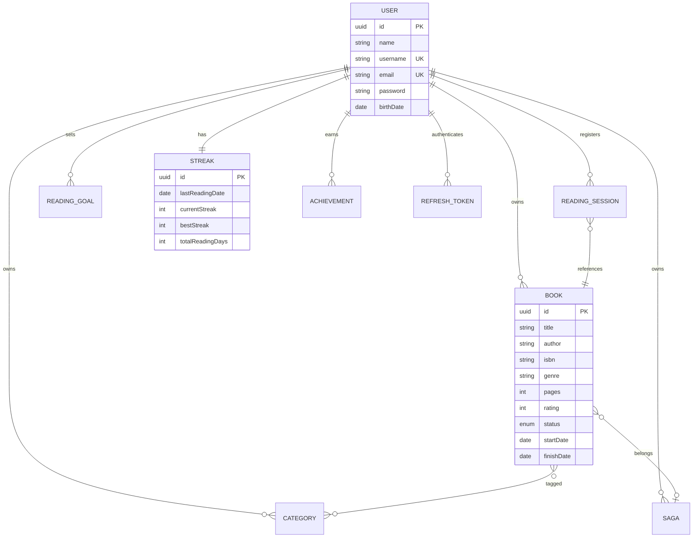
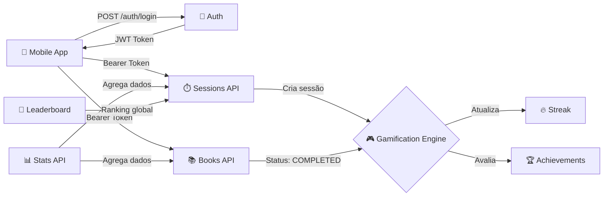

<div align="center">

# 📚 MyLibrary

### *Seu ecossistema pessoal de leitura com gamificação*

[](https://openjdk.org/)
[](https://spring.io/projects/spring-boot)
[](https://www.postgresql.org/)
[](https://reactnative.dev/)
[](https://expo.dev/)
[](https://www.docker.com/)
[](LICENSE)

---

**MyLibrary** transforma o hábito de leitura em uma experiência gamificada e social.
Acompanhe seus livros, registre sessões, desbloqueie conquistas, mantenha seu streak e
dispute rankings com outros leitores — tudo isso com uma API robusta e um app mobile nativo.

[Arquitetura](#-arquitetura) •
[Funcionalidades](#-funcionalidades) •
[API Reference](#-api-reference) •
[Quick Start](#-quick-start) •
[Roadmap](#-roadmap)

</div>

---

## 🏗️ Arquitetura

O projeto segue uma arquitetura **monorepo** com backend e mobile separados:

```text
mylibrary/
├── backend/          → API RESTful (Java 21 + Spring Boot 4)
├── mobile/           → App nativo (React Native + Expo 54)
└── README.md
```

### Backend — Stack Técnica

| Camada | Tecnologia | Descrição |
| :--- | :--- | :--- |
| **Linguagem** | Java 21 | LTS com Virtual Threads, Records e Pattern Matching |
| **Framework** | Spring Boot 4.0.5 | Auto-configuração, DI, AOP |
| **Persistência** | PostgreSQL + JPA/Hibernate | ORM com Criteria API para queries dinâmicas |
| **Segurança** | Spring Security + JWT | Bearer Token + Refresh Token multi-device |
| **Mapeamento** | MapStruct + Lombok | DTO ↔ Entity sem boilerplate |
| **Validação** | Bean Validation (Jakarta) | Validação declarativa nos DTOs |
| **Build** | Maven | Gerenciamento de dependências |
| **Deploy** | Docker (multi-stage) | Build + Runtime otimizados |

### Mobile — Stack Técnica

| Camada | Tecnologia | Descrição |
| :--- | :--- | :--- |
| **Framework** | React Native 0.81 | UI nativa cross-platform |
| **Plataforma** | Expo SDK 54 | Build, deploy e OTA updates |
| **Navegação** | Expo Router 6 | File-based routing |
| **Linguagem** | TypeScript 5.9 | Tipagem estática |
| **Animações** | Reanimated 4 + Gesture Handler | Micro-animações nativas |

### Padrão Arquitetural por Módulo

```text
Controller → Service → Repository → Entity
     ↑            ↓
    DTO      MapStruct
```

Cada domínio é um **package isolado e coeso**: `books`, `categories`, `saga`, `readingSession`, `readingGoal`, `streak`, `achievement`, `stats`, `leaderboard`, `auth`, `user`.

---

## ✨ Funcionalidades

### 📖 Gerenciamento de Biblioteca

- **CRUD completo de livros** com título, autor, ISBN, gênero, páginas, rating (1-5★), status e notas
- **4 status de leitura**: `TO_READ` → `READING` → `COMPLETED` / `DROPPED`
- **Busca avançada** com filtros combináveis (status, gênero, autor, rating mínimo, ano de conclusão)
- **Categorias personalizáveis** (tags) com relação Many-to-Many
- **Sagas** para agrupar séries de livros com cálculo de progresso em tempo real

### ⏱️ Sessões de Leitura

- Registrar **sessões manuais** com `pagesRead` e `durationMinutes`
- Consultar sessões por livro ou do usuário completo
- Cada sessão aciona automaticamente o **motor de gamificação**

### 🔥 Sistema de Streak

Motor de hábitos inspirado em apps de produtividade:

| Métrica | Descrição |
| :--- | :--- |
| `currentStreak` | Dias consecutivos com pelo menos 1 sessão |
| `bestStreak` | Maior sequência histórica do usuário |
| `totalReadingDays` | Total de dias únicos com leitura |
| `lastReadingDate` | Data da última sessão registrada |

**Regras de streak:**

- Leu **hoje** → streak mantido
- Leu **ontem** → `currentStreak++`
- Qualquer outro caso → reset para 1

### 🏆 Motor de Conquistas (Achievements)

**16 conquistas** distribuídas em 4 categorias, avaliadas automaticamente:

<details>
<summary><strong>📜 Ver todas as conquistas</strong></summary>

| Conquista | Categoria | Critério |
| :--- | :--- | :--- |
| 🏁 Primeira Página Virada | Volume | Completar 1 livro |
| 📚 Rato de Biblioteca | Volume | Completar 10 livros |
| 🏛️ Centurião | Volume | Completar 100 livros |
| 📖 Virador de Páginas | Volume | 10.000 páginas lidas |
| 🔥 Leitor de Ferro | Volume | Streak de 30 dias |
| ✅ Hábito Formado | Volume | Streak de 7 dias |
| ⚡ Devorador | Velocidade | Livro completo em ≤ 3 dias |
| 🏃 Maratonista | Velocidade | Sessão de ≥ 3 horas |
| 💥 Compulsivo | Velocidade | 3 livros em 1 semana |
| 🌍 Explorador | Diversidade | 5 gêneros diferentes |
| ⚔️ Caçador de Sagas | Diversidade | Completar 1 saga inteira |
| 🔎 Descobridor | Diversidade | 10 autores únicos |
| 🔮 Contrário | Diversidade | Rating 1★ e 5★ no mesmo mês |
| 💪 Esmagador de Metas | Metas | Meta anual superada em 20%+ |
| 🔄 De Volta ao Jogo | Metas | Retomar após 14+ dias |
| ✨ Sem Arrependimentos | Metas | Ano completo sem DROPPED |

</details>

### 🎯 Metas de Leitura (Reading Goals)

- **Meta anual** customizável: livros, páginas, autores e gêneros
- Progresso **calculado em tempo real** com insights
- Visibilidade `PUBLIC` ou `PRIVATE`
- Constraint: apenas **1 meta por ano por usuário** (409 se duplicar)

### 📊 Analytics & Inteligência de Leitura

| Endpoint | Feature | Inspiração |
| :--- | :--- | :--- |
| `/stats/dna` | Reading DNA — arquétipo e perfil | Spotify DNA |
| `/stats/heatmap` | Calendário de atividade por ano | GitHub Contributions |
| `/stats/velocity` | Ritmo de páginas/semana + projeções | Kindle Stats |
| `/stats/year-in-review` | Resumo anual gamificado | Spotify Wrapped |

### 🏅 Leaderboard — Ranking Global Top 100

Competição estilo **Clash Royale** — ranking limitado aos 100 primeiros:

| Métrica | Endpoint | Períodos |
| :--- | :--- | :--- |
| Páginas lidas | `/leaderboard/pages` | `WEEK`, `MONTH`, `ALL_TIME` |
| Livros concluídos | `/leaderboard/books` | `WEEK`, `MONTH`, `ALL_TIME` |
| Tempo de leitura | `/leaderboard/duration` | `WEEK`, `MONTH`, `ALL_TIME` |
| Nº de sessões | `/leaderboard/sessions` | `WEEK`, `MONTH`, `ALL_TIME` |
| Maior streak | `/leaderboard/streaks` | `ALL_TIME` |

### 🔐 Segurança Multi-Device

- **JWT Bearer Token** (HS256) com Access + Refresh Token
- **Multi-device**: cada dispositivo tem seu próprio refresh token
- **Logout seletivo**: invalida apenas o device especificado
- **Multi-tenant**: toda query é isolada por `userId`

---

## 📡 API Reference

> Base URL: `http://localhost:8080`
> Autenticação: `Authorization: Bearer <token>`

### 🔐 Auth

| Método | Endpoint | Descrição | Auth |
| :--- | :--- | :--- | :--- |
| `POST` | `/auth/register` | Criar conta | ❌ |
| `POST` | `/auth/login` | Login | ❌ |
| `GET` | `/auth/me` | Perfil autenticado | ✅ |
| `DELETE` | `/auth/logout?deviceId=` | Logout de um device | ✅ |
| `POST` | `/auth/refresh` | Renovar access token | ❌ |

### 📚 Books

| Método | Endpoint | Descrição |
| :--- | :--- | :--- |
| `POST` | `/books` | Criar livro |
| `GET` | `/books` | Listar (paginado + filtros) |
| `GET` | `/books/search?title=` | Busca por título |
| `GET` | `/books/{id}` | Detalhe do livro |
| `PATCH` | `/books/{id}` | Atualizar campos |
| `DELETE` | `/books/{id}` | Deletar |
| `POST` | `/books/{id}/categories/{catId}` | Associar categoria |
| `DELETE` | `/books/{id}/categories/{catId}` | Remover categoria |
| `GET` | `/books/{id}/categories` | Categorias do livro |

**Filtros disponíveis em `GET /books`:**

```text
?status=COMPLETED&genre=Fantasia&author=Tolkien&minRating=4&year=2025
```

### 📂 Categories

| Método | Endpoint | Descrição |
| :--- | :--- | :--- |
| `POST` | `/categories` | Criar |
| `GET` | `/categories` | Listar todas |
| `GET` | `/categories/{id}` | Detalhe |
| `PUT` | `/categories/{id}` | Atualizar |
| `DELETE` | `/categories/{id}` | Deletar |

### 🧭 Sagas

| Método | Endpoint | Descrição |
| :--- | :--- | :--- |
| `POST` | `/sagas` | Criar saga |
| `GET` | `/sagas` | Listar todas |
| `GET` | `/sagas/{id}` | Detalhe |
| `PUT` | `/sagas/{id}` | Atualizar |
| `DELETE` | `/sagas/{id}` | Deletar |
| `PATCH` | `/sagas/{id}/books/{bookId}` | Adicionar livro à saga |
| `DELETE` | `/sagas/{id}/books/{bookId}` | Remover livro |
| `GET` | `/sagas/{id}/books` | Livros da saga |
| `GET` | `/sagas/{id}/progress` | % de conclusão |

### ⏱️ Reading Sessions

| Método | Endpoint | Descrição |
| :--- | :--- | :--- |
| `POST` | `/reading-sessions` | Registrar sessão |
| `GET` | `/reading-sessions` | Listar todas |
| `GET` | `/reading-sessions/book/{bookId}` | Sessões por livro |
| `DELETE` | `/reading-sessions/{id}` | Deletar |

### 🎯 Reading Goals

| Método | Endpoint | Descrição |
| :--- | :--- | :--- |
| `POST` | `/reading-goals` | Criar meta |
| `GET` | `/reading-goals` | Listar todas |
| `GET` | `/reading-goals/{year}` | Meta do ano |
| `GET` | `/reading-goals/{year}/progress` | Progresso + insights |
| `PATCH` | `/reading-goals/{id}` | Atualizar meta |

### 🔥 Streak · 🏆 Achievements · 📊 Stats · 🏅 Leaderboard

| Método | Endpoint | Descrição |
| :--- | :--- | :--- |
| `GET` | `/streak` | Streak atual |
| `GET` | `/achievements` | Todas com progresso |
| `GET` | `/achievements/recent` | Conquistas recentes |
| `GET` | `/stats/dna` | Reading DNA |
| `GET` | `/stats/heatmap?year=` | Heatmap de atividade |
| `GET` | `/stats/velocity` | Velocidade + projeções |
| `GET` | `/stats/year-in-review?year=` | Year in Review |
| `GET` | `/leaderboard/pages?period=` | Top 100 páginas |
| `GET` | `/leaderboard/books?period=` | Top 100 livros |
| `GET` | `/leaderboard/duration?period=` | Top 100 duração |
| `GET` | `/leaderboard/sessions?period=` | Top 100 sessões |
| `GET` | `/leaderboard/streaks` | Top 100 streaks |

---

## 🚀 Quick Start

### Pré-requisitos

- **Java 21** (JDK)
- **PostgreSQL 15+**
- **Maven 3.9+**
- **Node.js 20+** (para o mobile)

### 1. Backend

```bash
# Clone o repositório
git clone https://github.com/gbatista/mylibrary.git
cd mylibrary/backend

# Configure as variáveis de ambiente
cp .env.example .env
# Edite o .env com suas credenciais do banco e JWT secret

# Rode a aplicação
./mvnw spring-boot:run
```

**Variáveis de ambiente necessárias:**

| Variável | Descrição | Exemplo |
| :--- | :--- | :--- |
| `DB_URL` | URL JDBC do PostgreSQL | `jdbc:postgresql://localhost:5432/mylibrary` |
| `DB_USERNAME` | Usuário do banco | `postgres` |
| `DB_PASSWORD` | Senha do banco | `secret` |
| `JWT_SECRET` | Chave secreta para assinar tokens | `minha-chave-secreta-256-bits` |

### 2. Docker

```bash
cd mylibrary/backend
docker build -t mylibrary-api .
docker run -p 8080:8080 --env-file .env mylibrary-api
```

### 3. Mobile

```bash
cd mylibrary/mobile
npm install
npx expo start
```

---

## 📐 Diagrama de Entidades



---

## 🔄 Fluxo da Aplicação



---

## 🛡️ Tratamento de Erros

Toda resposta de erro segue o padrão:

```json
{
  "status": 404,
  "error": "Not Found",
  "message": "Book not found with id: abc-123",
  "path": "/books/abc-123",
  "timestamp": "2026-03-29T14:00:00"
}
```

| HTTP Code | Quando |
| :--- | :--- |
| `400` | Validação falhou (campos inválidos) |
| `401` | Token ausente ou expirado |
| `403` | Acesso proibido |
| `404` | Recurso não encontrado |
| `409` | Conflito (duplicatas, constraints) |
| `500` | Erro interno (nunca expõe stack trace) |

---

## 🗺️ Roadmap

- [x] CRUD completo de Livros, Categorias e Sagas
- [x] Sistema de Sessões de Leitura
- [x] Autenticação JWT Multi-Device
- [x] Motor de Streak (hábitos diários)
- [x] Engine de 16 Conquistas
- [x] Analytics (DNA, Heatmap, Velocity, Year in Review)
- [x] Leaderboard Top 100 (5 métricas × 3 períodos)
- [x] Metas Anuais com progresso em tempo real
- [x] Busca avançada com Criteria API
- [x] Docker deploy
- [ ] 📱 Frontend mobile completo (Expo + React Native)
- [ ] 🔔 Push Notifications (FCM) baseadas em streaks e conquistas
- [ ] 🗄️ Flyway — migrações versionadas de banco
- [ ] 🧪 Testes de integração (JUnit + Testcontainers)
- [ ] ⚡ Cache Redis para leaderboard e stats
- [ ] 📄 OpenAPI / Swagger UI
- [ ] 📊 Export PDF do Year in Review

---

<div align="center">

### 🛠️ Feito com

[](https://openjdk.org/)
[](https://spring.io/)
[](https://www.postgresql.org/)
[](https://jwt.io/)
[](https://mapstruct.org/)
[](https://projectlombok.org/)
[](https://www.docker.com/)
[](https://reactnative.dev/)
[](https://expo.dev/)
[](https://www.typescriptlang.org/)

---

*Desenvolvido por [@gbatistaa](https://github.com/gbatistaa)*

</div>
