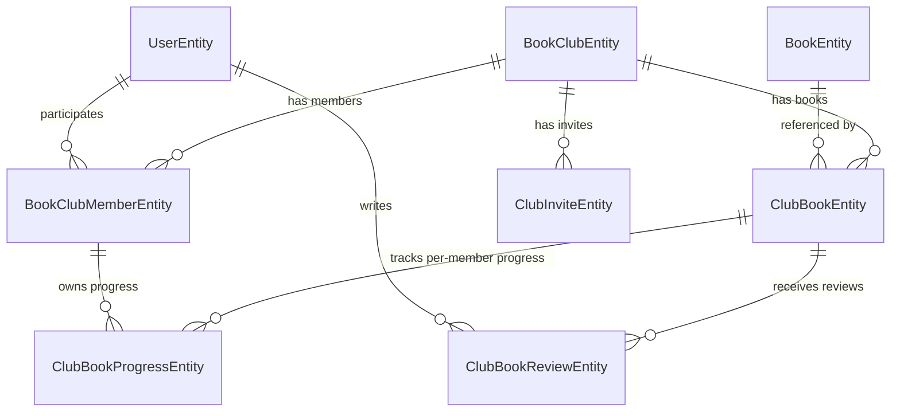
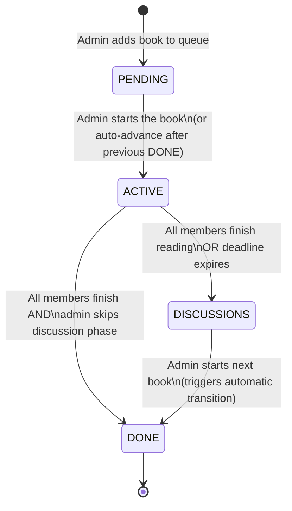
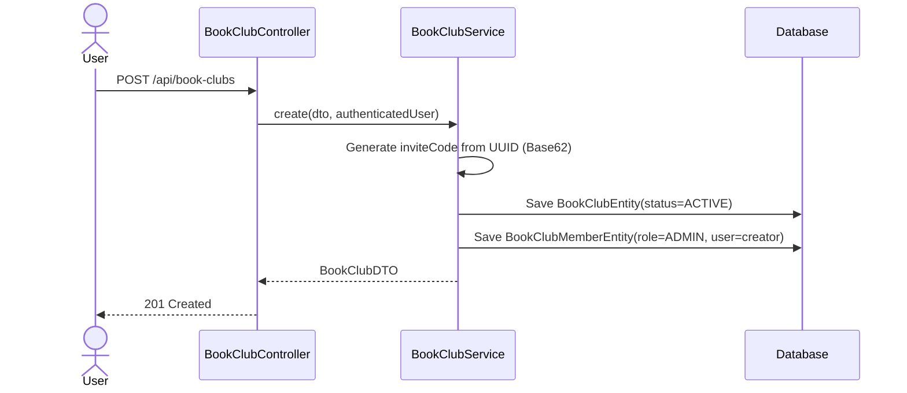
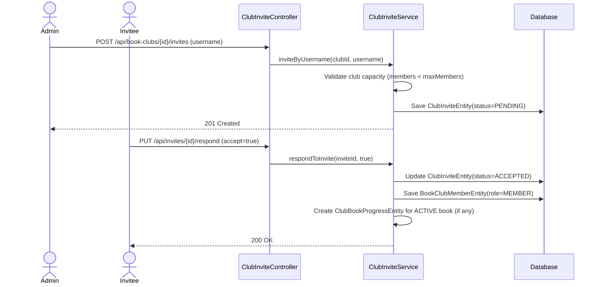
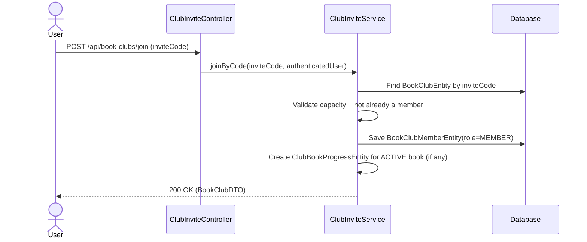
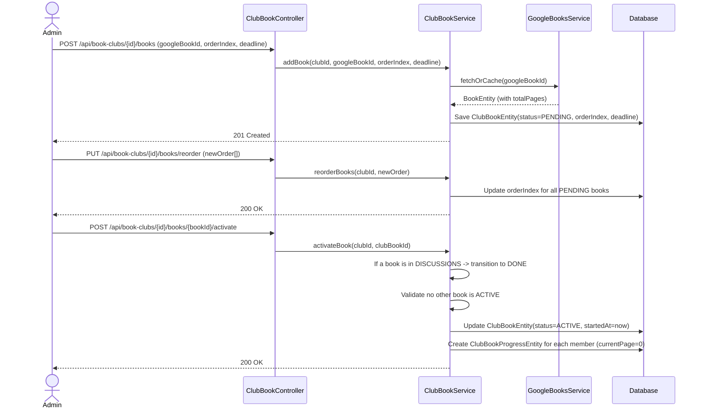
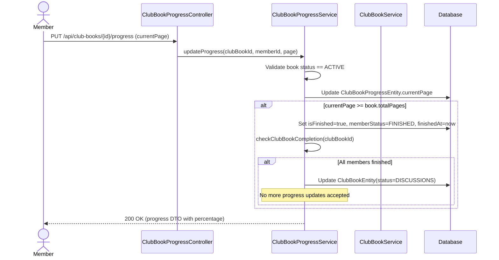
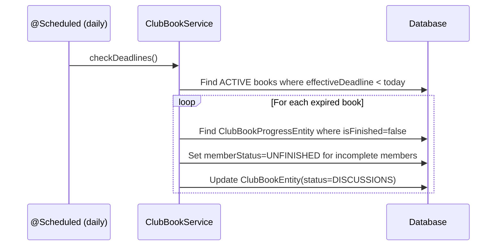
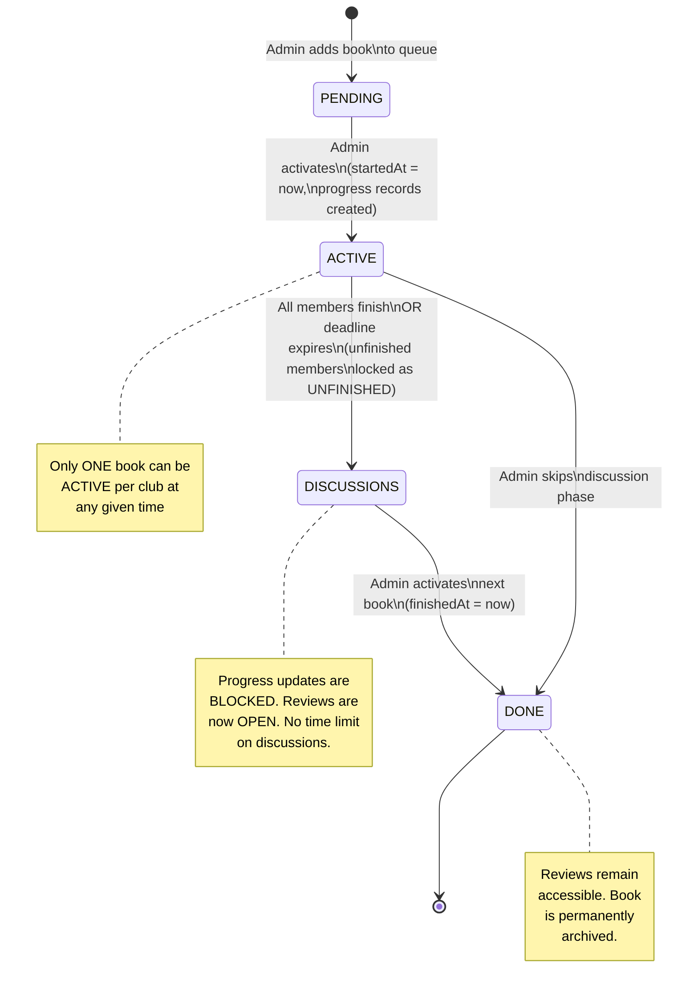

# Book Club Module — Architecture

## Overview

The Book Club module is a bounded context that manages the full lifecycle of reading clubs: creation, membership, book queue management, individual reading progress tracking, deadline enforcement, and discussion phases. It follows DDD principles with clear aggregate boundaries and explicit state machines.

---

## Domain Model (Entity Relationship)



---

## Aggregate Roots

| Aggregate Root   | Owned Entities                                     | Responsibility                                   |
| ---------------- | -------------------------------------------------- | ------------------------------------------------ |
| `BookClubEntity` | `BookClubMemberEntity`, `ClubInviteEntity`         | Club identity, membership, access control        |
| `ClubBookEntity` | `ClubBookProgressEntity`, `ClubBookReviewEntity`   | Book lifecycle within a club, reading tracking   |

---

## Entities

### 1. `BookClubEntity` (Aggregate Root)

The club itself. Owns membership and configuration.

| Field         | Type                         | Constraint        | Purpose                                          |
| ------------- | ---------------------------- | ----------------- | ------------------------------------------------ |
| `id`          | `UUID`                       | PK                | Inherited from `BaseEntity`                      |
| `name`        | `String`                     | NOT NULL, max 100 | Club display name                                |
| `description` | `String`                     | nullable          | Optional club description                        |
| `maxMembers`  | `Integer`                    | nullable, min 3   | Cap on membership (null = unlimited)             |
| `inviteCode`  | `String`                     | UNIQUE, NOT NULL  | Compressed UUID (Base62) for shareable join link |
| `status`      | `BookClubStatus`             | NOT NULL          | `ACTIVE`, `INACTIVE`, `ARCHIVED`                 |
| `admin`       | `UserEntity`                 | FK, NOT NULL      | The founding user who controls the club          |
| `members`     | `List<BookClubMemberEntity>` | cascade ALL       | All participants including the admin             |

**Key rules:**

- On creation, the creator is automatically inserted as a `BookClubMemberEntity` with role `ADMIN`.
- `inviteCode` is generated from the club's UUID via a deterministic compression algorithm (Base62 or similar). This allows sharing without exposing the raw UUID.
- Only the admin can transition status to `ARCHIVED` (soft-close). An archived club is read-only.
- A club with no remaining books in the queue simply idles — it is **never** auto-closed.

---

### 2. `BookClubMemberEntity`

Join table between users and clubs, carrying the role.

| Field  | Type                 | Constraint | Purpose                |
| ------ | -------------------- | ---------- | ---------------------- |
| `id`   | `UUID`               | PK         | Inherited              |
| `role` | `BookClubMemberRole` | NOT NULL   | `ADMIN`, `MEMBER`      |
| `club` | `BookClubEntity`     | FK         | Parent club            |
| `user` | `UserEntity`         | FK         | The participating user |

**Key rules:**

- Exactly one member per club must have `ADMIN` role (the founder).
- When a member joins, `ClubBookProgressEntity` records are created for the **currently ACTIVE** book (with `currentPage = 0`). Books already `DONE` or in `DISCUSSIONS` are not retroactively assigned.
- A unique constraint on `(club, user)` prevents duplicate membership.

---

### 3. `ClubInviteEntity`

Handles direct user-to-user invitations (separate from the invite code flow).

| Field       | Type             | Constraint | Purpose                                      |
| ----------- | ---------------- | ---------- | -------------------------------------------- |
| `id`        | `UUID`           | PK         | Inherited                                    |
| `token`     | `String`         | NOT NULL   | Unique invite token                          |
| `expiresAt` | `LocalDate`      | NOT NULL   | Expiration date                              |
| `isUsed`    | `Boolean`        | NOT NULL   | Whether it has been consumed                 |
| `status`    | `InviteStatus`   | NOT NULL   | `PENDING`, `ACCEPTED`, `REJECTED`, `EXPIRED` |
| `club`      | `BookClubEntity` | FK         | Target club                                  |
| `inviter`   | `UserEntity`     | FK         | Who sent the invite                          |
| `invitee`   | `UserEntity`     | FK         | Who receives the invite                      |

**Two invitation paths exist:**

1. **Direct invite** — admin searches by username, system creates a `ClubInviteEntity` targeting that user.
2. **Invite code** — any member shares the club's `inviteCode`. The joining user calls a join endpoint with the code; no `ClubInviteEntity` is created.

---

### 4. `ClubBookEntity`

A slot in the club's reading queue. This is **not** the book itself — it is the book's context within a specific club.

| Field                | Type             | Constraint | Purpose                                                      |
| -------------------- | ---------------- | ---------- | ------------------------------------------------------------ |
| `id`                 | `UUID`           | PK         | Inherited                                                    |
| `orderIndex`         | `Integer`        | NOT NULL   | Position in the reading queue (admin-defined)                |
| `status`             | `ClubBookStatus` | NOT NULL   | `PENDING`, `ACTIVE`, `DISCUSSIONS`, `DONE`                   |
| `deadline`           | `LocalDate`      | nullable   | Admin-set deadline for finishing the book                    |
| `deadlineExtendedAt` | `LocalDate`      | nullable   | Extended deadline (max `deadline + 10 days`)                 |
| `startedAt`          | `LocalDate`      | nullable   | When the book became `ACTIVE`                                |
| `finishedAt`         | `LocalDate`      | nullable   | When the book transitioned to `DONE`                         |
| `club`               | `BookClubEntity` | FK         | Parent club                                                  |
| `book`               | `BookEntity`     | FK         | Reference to the canonical book data (from Google Books API) |

#### ClubBookStatus State Machine



**Transition rules in detail:**

| From          | To            | Trigger                                                                                                                                                                                                                                                                        |
| ------------- | ------------- | ------------------------------------------------------------------------------------------------------------------------------------------------------------------------------------------------------------------------------------------------------------------------------ |
| `PENDING`     | `ACTIVE`      | Admin manually activates. Only **one** book per club can be `ACTIVE` at a time. Sets `startedAt = now()`. Creates `ClubBookProgressEntity` for every current member.                                                                                                           |
| `ACTIVE`      | `DISCUSSIONS` | **Automatic** when the last member marks the book as finished (all progress records have `isFinished = true`). OR **automatic** when the effective deadline (`deadlineExtendedAt ?? deadline`) expires — members who haven't finished get `memberStatus = UNFINISHED`.         |
| `ACTIVE`      | `DONE`        | Only if admin explicitly skips the discussion phase (optional shortcut).                                                                                                                                                                                                       |
| `DISCUSSIONS` | `DONE`        | **Automatic** when the admin activates the next `PENDING` book. The current `DISCUSSIONS` book transitions to `DONE` and sets `finishedAt = now()`. During `DISCUSSIONS`, no further progress updates are accepted — any member who hasn't finished is locked as `UNFINISHED`. |

**Deadline logic:**

- `deadline` is set by the admin when adding or editing the book.
- `deadlineExtendedAt` can be set by the admin but must satisfy: `deadlineExtendedAt <= deadline + 10 days`.
- The effective deadline is `deadlineExtendedAt` if present, otherwise `deadline`.
- A scheduled job (`@Scheduled`) checks daily for `ACTIVE` books past their effective deadline and triggers the `ACTIVE -> DISCUSSIONS` transition.

---

### 5. `ClubBookProgressEntity`

Per-member reading progress for a specific club book. This is where individual tracking lives.

| Field          | Type                   | Constraint | Purpose                                     |
| -------------- | ---------------------- | ---------- | ------------------------------------------- |
| `id`           | `UUID`                 | PK         | Inherited                                   |
| `currentPage`  | `Integer`              | NOT NULL   | Last reported page (starts at 0)            |
| `isFinished`   | `Boolean`              | NOT NULL   | Whether the member has completed the book   |
| `memberStatus` | `ClubBookMemberStatus` | NOT NULL   | `READING`, `FINISHED`, `UNFINISHED`         |
| `finishedAt`   | `LocalDate`            | nullable   | When the member marked the book as complete |
| `member`       | `BookClubMemberEntity` | FK         | The club member                             |
| `clubBook`     | `ClubBookEntity`       | FK         | The club book being tracked                 |

**Key rules:**

- Created automatically when a `ClubBookEntity` transitions to `ACTIVE`, one per member with `currentPage = 0`, `isFinished = false`, `memberStatus = READING`.
- Progress updates (page number) are only accepted while the parent `ClubBookEntity` is `ACTIVE`.
- When `currentPage >= book.totalPages`, the system automatically sets `isFinished = true`, `memberStatus = FINISHED`, `finishedAt = now()`.
- If the book transitions to `DISCUSSIONS` and `isFinished = false`, `memberStatus` is locked to `UNFINISHED`.
- Reading percentage = `(currentPage / book.totalPages) * 100`.
- A unique constraint on `(member, clubBook)` prevents duplicate progress records.

---

### 6. `ClubBookReviewEntity`

Post-reading reviews, only available during `DISCUSSIONS` or `DONE` phases.

| Field        | Type             | Constraint | Purpose                 |
| ------------ | ---------------- | ---------- | ----------------------- |
| `id`         | `UUID`           | PK         | Inherited               |
| `rating`     | `Integer`        | NOT NULL   | 1-5 star rating         |
| `reviewText` | `String`         | NOT NULL   | Written review          |
| `clubBook`   | `ClubBookEntity` | FK         | The book being reviewed |
| `user`       | `UserEntity`     | FK         | The reviewer            |

**Key rules:**

- Reviews can only be submitted when the `ClubBookEntity` status is `DISCUSSIONS` or `DONE`.
- One review per user per club book (unique constraint on `(user, clubBook)`).

---

## Enums

### `BookClubStatus`

```text
ACTIVE      — Club is operational
INACTIVE    — Temporarily paused (no active reading)
ARCHIVED    — Permanently closed by admin (read-only)
```

### `BookClubMemberRole`

```text
ADMIN       — Club founder; full control
MEMBER      — Regular participant
```

### `ClubBookStatus` (new)

```text
PENDING       — Queued, not yet started
ACTIVE        — Currently being read
DISCUSSIONS   — Reading period over, discussion open, no more progress updates
DONE          — Completed and archived
```

### `ClubBookMemberStatus` (new)

```text
READING       — Currently reading
FINISHED      — Completed the book within the deadline
UNFINISHED    — Did not complete before the book left ACTIVE status
```

### `InviteStatus`

```text
PENDING     — Awaiting response
ACCEPTED    — User joined the club
REJECTED    — User declined
EXPIRED     — Past expiration date
```

---

## Services

### `BookClubService`

Manages club CRUD and lifecycle.

| Method                  | Description                                                                                            |
| ----------------------- | ------------------------------------------------------------------------------------------------------ |
| `create(dto)`           | Creates club, generates `inviteCode` from UUID, auto-creates `BookClubMemberEntity(ADMIN)` for creator |
| `findById(id)`          | Returns club with membership info                                                                      |
| `findAllByUser(userId)` | Returns all clubs where user is a member                                                               |
| `update(id, dto)`       | Updates name, description, maxMembers (admin only)                                                     |
| `archive(id)`           | Sets status to `ARCHIVED` (admin only). No further mutations allowed                                   |
| `delete(id)`            | Hard delete (admin only, only if no books have been started)                                           |

---

### `ClubInviteService`

Handles both invitation flows.

| Method                               | Description                                                                                      |
| ------------------------------------ | ------------------------------------------------------------------------------------------------ |
| `inviteByUsername(clubId, username)` | Creates a `ClubInviteEntity` targeting the user. Validates club capacity                         |
| `respondToInvite(inviteId, accept)`  | Accepts or rejects. On accept: creates `BookClubMemberEntity(MEMBER)` + progress for active book |
| `joinByCode(inviteCode)`             | Looks up club by `inviteCode`, validates capacity, creates membership directly                   |

---

### `ClubBookService`

Manages the book queue and lifecycle transitions.

| Method                                          | Description                                                                                                                                                         |
| ----------------------------------------------- | ------------------------------------------------------------------------------------------------------------------------------------------------------------------- |
| `addBook(clubId, bookId, orderIndex, deadline)` | Admin adds a book to the queue as `PENDING`. Book data fetched/cached from Google Books API                                                                         |
| `reorderBooks(clubId, newOrder)`                | Admin reorders the `PENDING` books (cannot reorder `ACTIVE`/`DISCUSSIONS`/`DONE`)                                                                                   |
| `activateBook(clubId, clubBookId)`              | Admin starts a book: transitions `PENDING -> ACTIVE`, creates progress records for all members. If another book is in `DISCUSSIONS`, it transitions to `DONE` first |
| `extendDeadline(clubBookId, newDate)`           | Admin extends deadline. Validates `newDate <= originalDeadline + 10 days`                                                                                           |
| `removeBook(clubBookId)`                        | Admin removes a `PENDING` book from the queue. Cannot remove `ACTIVE`/`DISCUSSIONS`/`DONE` books                                                                    |
| `checkDeadlines()`                              | `@Scheduled` daily job. Finds `ACTIVE` books past effective deadline, transitions to `DISCUSSIONS`, marks unfinished members as `UNFINISHED`                        |

---

### `ClubBookProgressService`

Tracks individual member reading progress.

| Method                                       | Description                                                                                   |
| -------------------------------------------- | --------------------------------------------------------------------------------------------- |
| `updateProgress(clubBookId, memberId, page)` | Updates `currentPage`. Rejects if book is not `ACTIVE`. Auto-finishes if `page >= totalPages` |
| `markAsFinished(clubBookId, memberId)`       | Explicitly marks member as finished. Triggers completion check                                |
| `checkClubBookCompletion(clubBookId)`        | If all members are finished, transitions book `ACTIVE -> DISCUSSIONS`                         |
| `getProgressForMember(memberId, clubBookId)` | Returns current progress and percentage                                                       |
| `getProgressForClubBook(clubBookId)`         | Returns all members' progress (for club dashboard)                                            |

---

### `ClubBookReviewService`

Manages post-reading reviews.

| Method                                  | Description                                                       |
| --------------------------------------- | ----------------------------------------------------------------- |
| `submitReview(clubBookId, userId, dto)` | Creates review. Only allowed if book is `DISCUSSIONS` or `DONE`   |
| `getReviewsForBook(clubBookId)`         | Returns all reviews for a club book                               |
| `updateReview(reviewId, dto)`           | Author edits their own review                                     |
| `deleteReview(reviewId)`                | Author or admin deletes a review                                  |

---

## Core Flows

### Flow 1 — Club Creation



---

### Flow 2 — Joining a Club

#### 2a. Direct Invite (by username search)



#### 2b. Join by Invite Code



---

### Flow 3 — Book Queue Management



---

### Flow 4 — Reading Progress & Book Completion



---

### Flow 5 — Deadline Expiration (Scheduled)



---

### Flow 6 — Full Book Lifecycle (End-to-End)



---

## Package Structure

```bash
bookClub/
  |-- clubs/
  |     |-- BookClubEntity.java
  |     |-- BookClubRepository.java
  |     |-- BookClubService.java
  |     |-- BookClubController.java
  |     |-- enums/
  |     |     |-- BookClubStatus.java
  |     |-- dtos/
  |     |     |-- BookClubDTO.java
  |     |     |-- CreateBookClubDTO.java
  |     |     |-- UpdateBookClubDTO.java
  |     |-- mappers/
  |           |-- BookClubMapper.java
  |
  |-- bookClubMembers/
  |     |-- BookClubMemberEntity.java
  |     |-- BookClubMemberRepository.java
  |     |-- BookClubMemberRole.java
  |
  |-- clubBook/
  |     |-- ClubBookEntity.java
  |     |-- ClubBookRepository.java
  |     |-- ClubBookService.java
  |     |-- ClubBookController.java
  |     |-- enums/
  |     |     |-- ClubBookStatus.java
  |     |     |-- ClubBookMemberStatus.java
  |     |-- dtos/
  |     |-- mappers/
  |
  |-- clubBookProgress/
  |     |-- ClubBookProgressEntity.java
  |     |-- ClubBookProgressRepository.java
  |     |-- ClubBookProgressService.java
  |     |-- ClubBookProgressController.java
  |     |-- dtos/
  |     |-- mappers/
  |
  |-- clubBookReview/
  |     |-- ClubBookReviewEntity.java
  |     |-- ClubBookReviewRepository.java
  |     |-- ClubBookReviewService.java
  |     |-- ClubBookReviewController.java
  |     |-- dtos/
  |     |-- mappers/
  |
  |-- clubInvite/
  |     |-- ClubInviteEntity.java
  |     |-- ClubInviteRepository.java
  |     |-- ClubInviteService.java
  |     |-- ClubInviteController.java
  |     |-- InviteStatus.java
  |     |-- dtos/
  |     |-- mappers/
  |
  |-- ARCHITECTURE.md
```

---

## Invariants (Business Rules Summary)

1. **One active book per club** — At most one `ClubBookEntity` can have `status = ACTIVE` per club at any time.
2. **Auto-member on creation** — The club creator is automatically a member with `ADMIN` role.
3. **Progress only when ACTIVE** — `ClubBookProgressEntity` updates are rejected unless the parent `ClubBookEntity.status == ACTIVE`.
4. **Auto-finish detection** — When `currentPage >= book.totalPages`, the member is automatically marked as `FINISHED`.
5. **Auto-discussion transition** — When all `ClubBookProgressEntity` records for a book have `isFinished = true`, the book transitions to `DISCUSSIONS`.
6. **Deadline enforcement** — A `@Scheduled` job transitions overdue `ACTIVE` books to `DISCUSSIONS`, marking incomplete members as `UNFINISHED`.
7. **Extension cap** — `deadlineExtendedAt` must be at most 10 calendar days after the original `deadline`.
8. **Discussion locks progress** — Once in `DISCUSSIONS`, no member can update their reading progress. Their `memberStatus` is frozen.
9. **Admin advances manually** — The transition from `DISCUSSIONS` to `DONE` is triggered by the admin activating the next book (or explicitly closing discussion).
10. **Club never auto-closes** — When the queue is empty after the last book is `DONE`, the club remains `ACTIVE`. Only the admin can `ARCHIVE` it.
11. **Reviews during/after discussion** — Reviews can only be submitted when the book is in `DISCUSSIONS` or `DONE` status.
12. **One review per member per book** — Enforced by unique constraint `(user, clubBook)`.
13. **Atomic transitions** — All state transitions are wrapped in `@Transactional` to ensure consistency.

---

## Changes Required vs. Current Codebase

| Entity / Enum               | Current State                        | Required Change                                                                                                                           |
| --------------------------- | ------------------------------------ | ----------------------------------------------------------------------------------------------------------------------------------------- |
| `BookClubEntity`            | Missing `inviteCode`, `status`       | Add `inviteCode` (String, unique) and `status` (BookClubStatus) fields                                                                    |
| `ClubBookEntity`            | Uses `isCurrent` boolean             | Replace with `status` enum (`ClubBookStatus`). Add `deadline` and `deadlineExtendedAt` fields. Remove `currentPage` (belongs in progress) |
| `ClubBookProgressEntity`    | Missing `isFinished`, `memberStatus` | Add `isFinished` (Boolean), `memberStatus` (ClubBookMemberStatus)                                                                         |
| `BookClubMemberRole`        | Has `INVITED`                        | Remove `INVITED` (invitation state lives in `ClubInviteEntity`, not in membership role)                                                   |
| New: `ClubBookStatus`       | Does not exist                       | Create enum: `PENDING`, `ACTIVE`, `DISCUSSIONS`, `DONE`                                                                                   |
| New: `ClubBookMemberStatus` | Does not exist                       | Create enum: `READING`, `FINISHED`, `UNFINISHED`                                                                                          |
